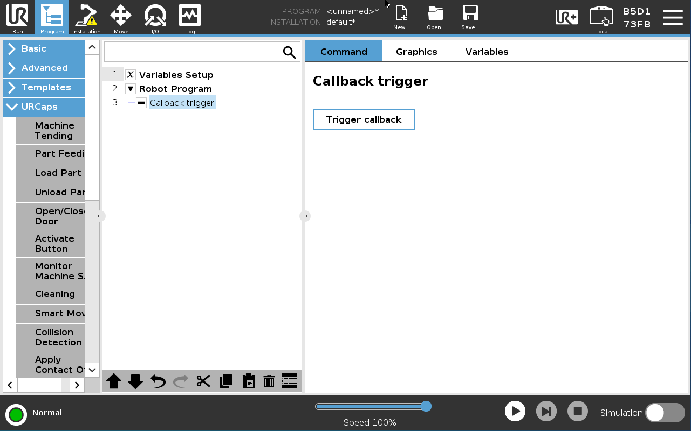
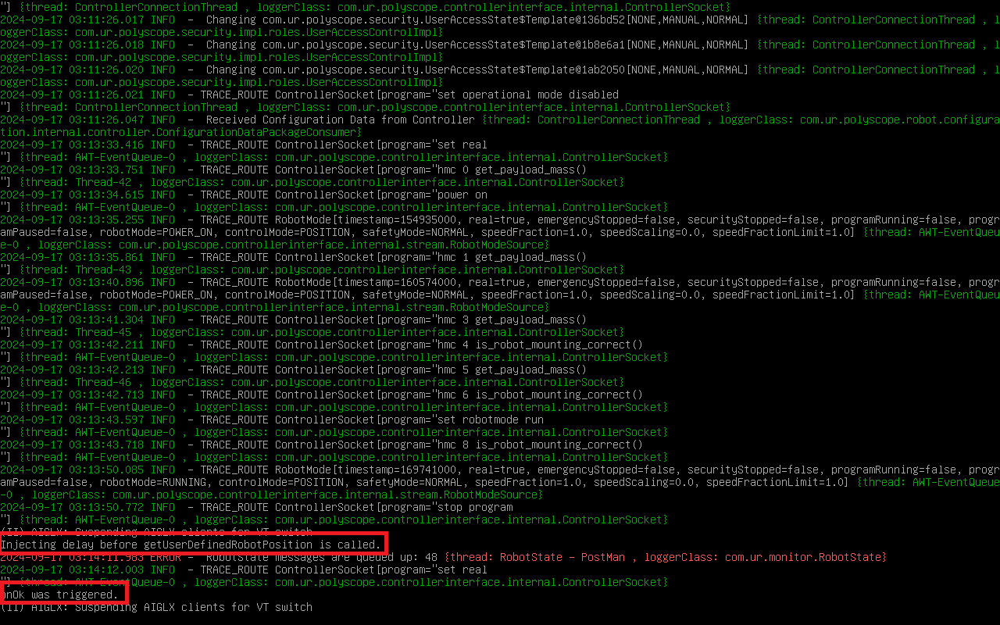

# Build the Sample
To build the sample, simple run a `mvn install` or `mvn install -P remote`.

 

 

# Run the Sample
When installed, you should see the following program node configuration after inserting the "Callback trigger" node:

After hitting the "Trigger callback" button, a delay is introduced and then the robot position screen pops up. Hitting `CTRL-ALT-F9` on a keyboard plugged into the robot should bring up the Polyscope log. You should see that a message was printed talking about the injected delay. If you then hit "OK" in Polyscope to confirm the location, you should properly see the "onOk callback triggered" message in the Polyscope log:

